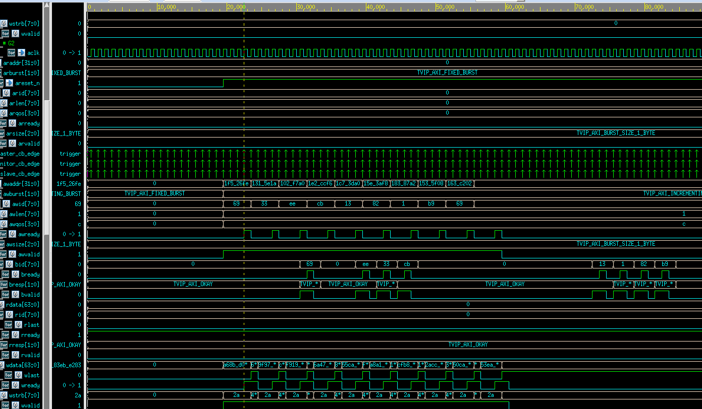

## AXI Safety Connector
### Capability
 - Read/Write Burst
 - Outstanding Write/Read
 - Out-of-order Slave Response
 
## Get Started
```
git clone https://GeorgeLin200100/AXI4_Interconnect.git
cd AXI4_Interconnect/lxd/TVIP-AXI/sample/work/

make compile_vcs

# Usage:
# TEST = default/out_of_order_response/outstanding_access/read_interleave/ready_delay/request_delay/response_delay/wvalid_preceding_awvalid
# SEQ = BASIC_WRITE_READ/SEQUENCE_BY_SEQUENCE/SEQUENCE_BY_ITEM/OUTSTANDING_WRITE/ALL_SEQUENCES

# to test outstanding access behavior
export TEST=outstanding_access
export SEQ=OUSTANDING_WRITE
make sim_vcs TEST=$(TEST) SEQ=$(SEQ)

# to view simv.log
cat $(TEST)/simv.log

## to view waveform (shall carry the TEST arg same as the former command)
cd ../..
./open_verdi.sh $(TEST)
```

## Results
##### Outstanding Write Waveform
